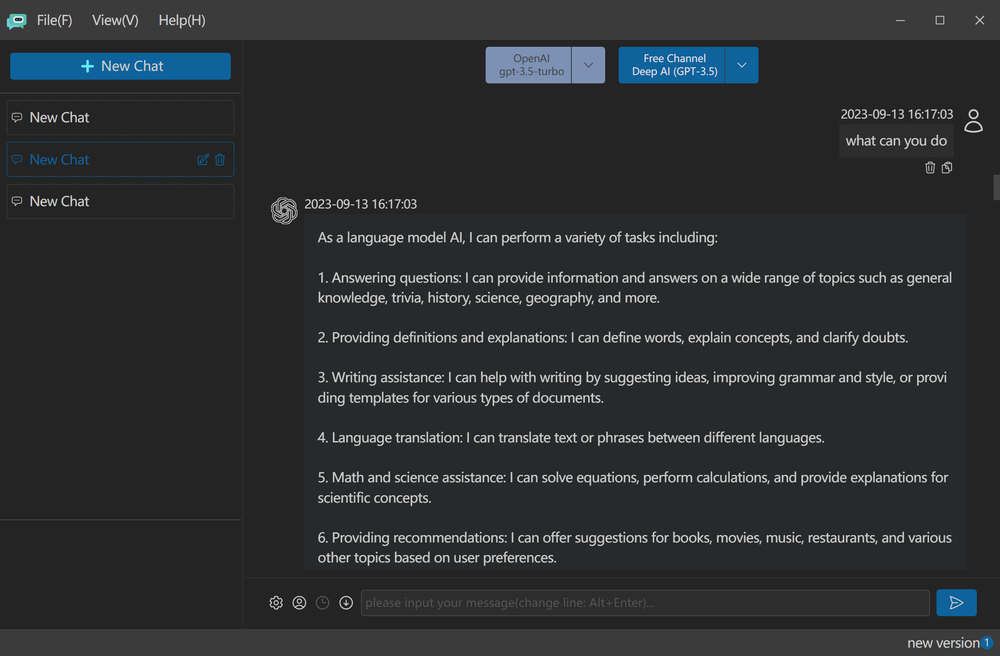
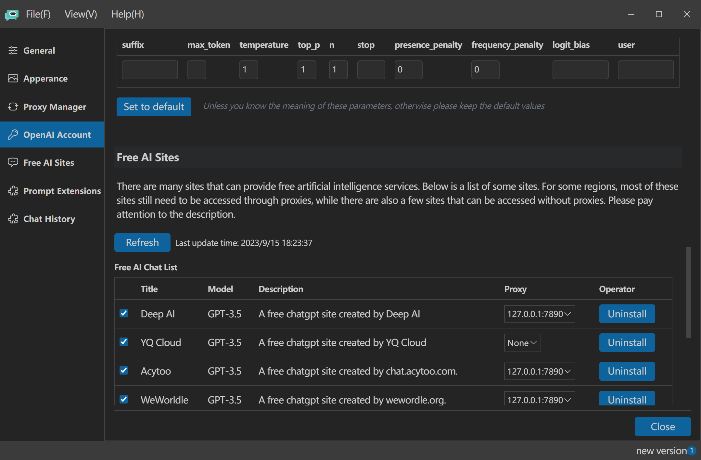
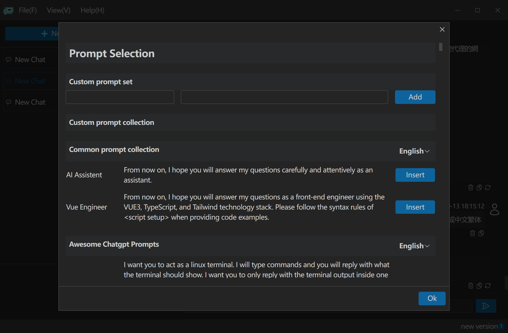

# Super AI Assistant						[[中文](https://github.com/androidminds/SuperAIAssistant/blob/main/README_zh.md)]

This project is a localized version of ChatGPT, which utilizes chatgpt to assist us in various interesting tasks such as dialog, translation, drawing and more, Currently, it is focused on enhancing dialog capabilities, but I plan to expand its functionality through future updates.

Apart from  ChatGPT, this application also leverages the capabilities of various free ChatGPT sites, made accessible through the  [FreeGPT4](https://github.com/xtekky/gpt4free) project. These free site are not stable to use, just for you to experience the AI dialog.

This application has been developed using Electron, Vue3, Tailwind, Type Script and Python.

## Installation

#### Desktop applications

| Operating System        | Download                                                  |
| ----------------------- | --------------------------------------------------------- |
| Windows (32 and 64-bit) | https://github.com/androidminds/SuperAIAssistant/releases |
| Linux                   |                                                           |

## Compile from the source

1. git clone
2. npm i
3. npm run build

## UI

