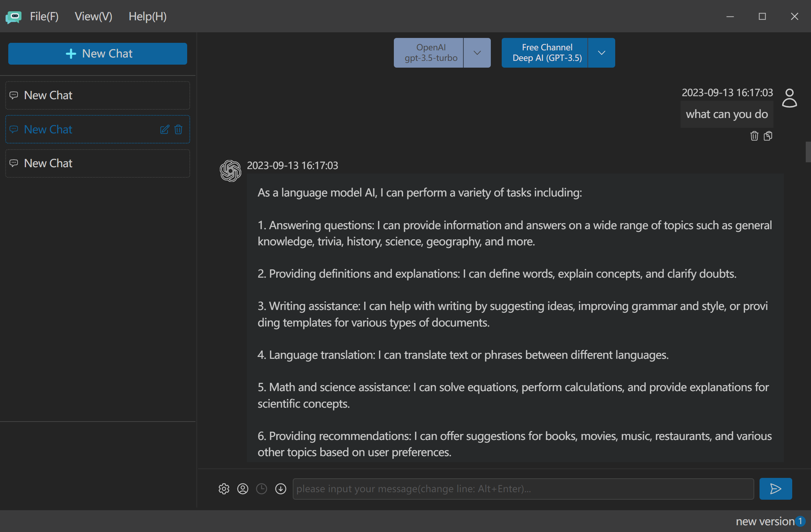

# Super AI Assistant						[[English](https://github.com/androidminds/SuperAIAssistant/blob/main/README.md)]

本项目是 ChatGPT 的本地化版本，利用 ChatGPT 帮助我们完成各种有趣的任务，比如对话、翻译、绘画等。目前，它正在专注于提高对话功能，未来会逐渐的更新扩展它的功能。

由于没有可用的调试帐户，现在不支持 GPT4 API，一旦获得可用的帐户，这个问题就会得到解决。

除了 ChatGPT，本项目还利用了各种免费 ChatGPT 网站的能力，这些网站可以通过 [FreeGPT4](https://github.com/xtekky/gpt4free) 项目提供的方法访问。不过这些免费站点不稳定，仅供体验人工智能对话。

本应用使用 Electron、Vue3、Tailwind、Type Script 和 Python 开发。

## 安装

#### 桌面应用

| 操作系统                | 下载                                                      |
| ----------------------- | --------------------------------------------------------- |
| Windows (32 and 64-bit) | https://github.com/androidminds/SuperAIAssistant/releases |
| Linux                   |                                                           |

## 编译

1. git clone
2. npm i
3. npm run build

## 界面

